  

# Hi there, I'm Emanuele! 

MSc Cybersecurity Engineering Student @ <a href="https://www.polito.it/">PoliTo</a> 🇮🇹
 

  
  

---

### 🔭 About Me & Interests
- 🎓 I’m currently pursuing an **MSc in Cybersecurity Engineering** at Politecnico di Torino (@ <a href="https://www.polito.it/">PoliTO</a>), enrolled in a **Twin Track** program to earn a second Master's Degree in **Computer Engineering**.
- 🎓 I hold a **BSc in Computer Engineering (Software track)** from the University of Salerno (@ <a href="https://www.unisa.it/">UniSA</a>).
- 🔐 I’m passionate about **Cybersecurity** and **Embedded Systems**.
- 🚁 In my free time, I am a **Photography Enthusiast** and a **Drone Pilot**.
- 🎮 I'm also a huge fan of **Video Games**, **Cinema**, and **Anime**.

---

### 🛠️ Languages & Tools

---
### 📊 GitHub Stats

